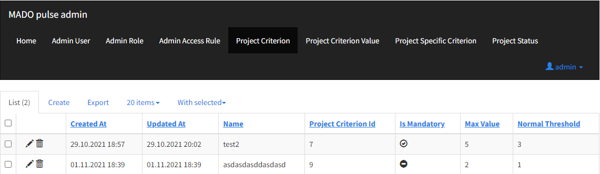
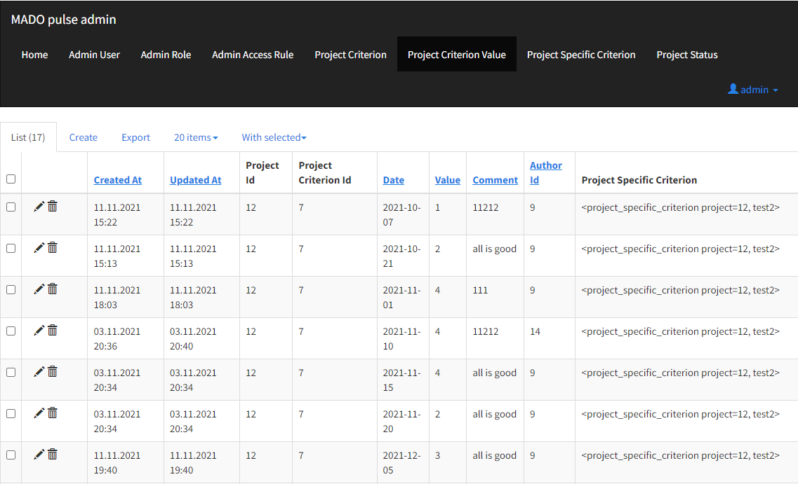
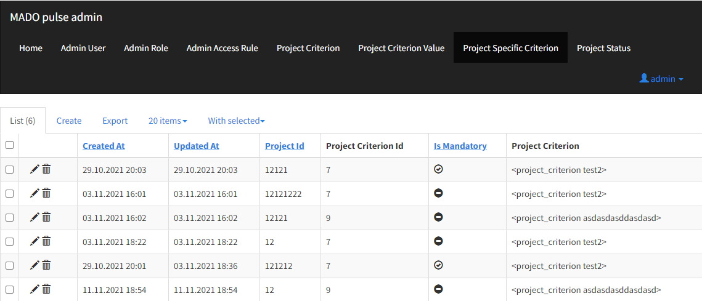
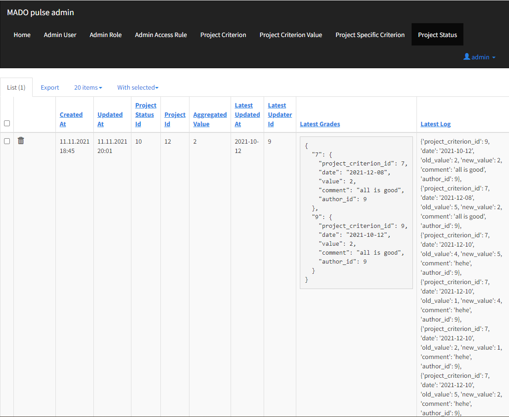

# PULSE

Service for tracking the status of projects
Сервис имеет следующую функциональность:
* `Web interface`;
* `Integration with a third-party authorization server (with info about users, staff and projects)`;
* `The main page displays the current projects and the total indicator, which is calculated as
  the minimum score for the indicator on the project for each project criterion on a 5-point scale, which is calculated 
  based 
  on the ratings for each of the project indicators`;
* `The project page shows list of indicators along with grades and graphical display of the status of indicators`;
* `Editing activities with an indication of the current rating indicator this activity affects`;
* `Ability to view a list of developers working on the current project`.

## Table of contents

- [Tables](#tables)
- [Environment variables](#environment-variables)

## Tables

This backend contains following tables

* project_criterion (WIP)
* project_specific_criterion (WIP)
* project_criterion_value (WIP)
* project_status (WIP)

## Environment variables

You can redefine environment variables in `pulse.env` file

List of variables

* `PULSE_VERSION` - optional (`0.0.1` by default); version of API
* `PULSE_DATABASE_URI` - **required**; database URI
* `PULSE_CORS_ORIGINS` - optional (`[]` by default); list of CORS allowable origins
* `PULSE_LOG` - optional (`false` by default); is it needs logging
* `PULSE_PORT` - optional (`5000` by default); port for local running
* `PULSE_URL_PREFIX` - optional (`/pulse/api/v1` by default); prefix for API, docs, static files and templates
* `PULSE_ADMIN_URL_PREFIX` - optional (`/pulse` by default); prefix for admin route
* `PULSE_CELERY_BROKER_URL` - optional (`redis://127.0.0.1:6379/1` by default); URL of the default broker for celery
* `PULSE_CELERY_IMPORTS` - optional (`['app.celery.tasks']` by default); list of modules celery worker should import
* `PULSE_CELERY_TIMEZONE` - optional (`Europe/Moscow` by default); celery worker timezone
* `ITS_CLIENT_ID` - optional (`mado` by default); ITS OAuth2 application ID
* `USE_OAUTH2_AUTHORIZATION` - optional (`true` by default); is it needs authorization only by one service
* `PULSE_WORKERS` - optional; number of uvicorn workers
* `BROKER_HOST` - optional (`127.0.0.1` by default); host of the message broker
* `BROKER_PORT` - optional (`5672` by default); port of the message broker
* `BROKER_LOGIN` - optional (`guest` by default); user login for the message broker
* `BROKER_PASSWORD` - optional (`guest` by default); user password for the message broker
* `PULSE_BROKER_SERVICE_QUEUE` - optional (`rpc_pulse_queue` by default); name of queue for incoming messages for this service
* `PULSE_BROKER_CLIENT_QUEUE` - optional (`rpc_pulse_queue` by default); name of queue for workers requests results messages
* `STAFF_BROKER_SERVICE_QUEUE` - optional (`rpc_staff_queue` by default); name of queue for incoming messages for staff service
* `PULSE_FLASK_ADMIN_SWATCH` - optional (`cosmo` by default); name of theme for Flask-Admin
* `PULSE_SECURITY_REGISTERABLE` - optional (`true` by default); is it possible to register new user for CRUD admin by Flask-Admin
* `PULSE_SECURITY_PASSWORD_SALT` - **required**; HMAC salt for passwords hashing for Flask-Admin
* `PULSE_SECRET_KEY` - **required**; secret key that will be used for securely signing the session cookie of Flask-Admin
* `PULSE_ADMIN_USER_NAME` - **required**; default admin user for Flask-Admin
* `PULSE_ADMIN_USER_PASSWORD` - **required**; password for default admin user for Flask-Admin
* `PULSE_LATEST_PULSE_LOG_MAX_SIZE` - optional (`7` by default); value of the max number of Pulse log records

#Views of admin panel with some values:
* ##Project Criterion 

* ##Project Criterion Value 

* ##Project Specific Criterion 

* ##Project Status

